# Fluxogramas — Manutenção Preditiva de Zero-Downtime

---

## 📌 Fluxograma 1: Fluxo de Utilização (User Flow)

Descreve as ações que ocorrem a partir dos inputs do usuário no dashboard **PredictiveOPS**.

```mermaid
flowchart TD
    A([🚀 Usuário acessa o Dashboard\nPredictiveOPS v4.2]) --> B{Sistema possui dados?}

    B -- Não --> C[Tela de espera\n'System Idle']
    C --> D([📂 Usuário clica em\n'Ingest CSV'])
    D --> E[Upload do arquivo .csv\ncom dados de sensores]
    E --> F{Arquivo válido?}

    F -- Não --> G[❌ Exibe erro:\n'CSV inválido ou colunas ausentes']
    G --> D

    F -- Sim --> H[DataProcessor.parseCSV\nLeitura e parsing do arquivo]
    H --> I[DataProcessor.cleanData\nLimpeza, mapeamento de falhas\ne remoção de nulos]
    I --> J[Estado: DATA_READY\nKPIs resumidos exibidos\nStream Status ativo]

    J --> K([▶️ Usuário clica em\n'Execute Training'])
    K --> L[DataProcessor.prepareXY\nEncoding OHE + Escalonamento]
    L --> M[DataProcessor.splitData\nStratified Split 70%/30%]
    M --> N[Bootstrap Oversampling\nno conjunto de treino]
    N --> O[ModelService.trainAllModels\nTreina 7 algoritmos em paralelo]

    O --> P[Resultados calculados:\nAccuracy · Recall · F1 · CV Score\nConfusion Matrix · Feature Importance]
    P --> Q[Best model auto-selecionado\npor maior F1-Score]

    Q --> R[Dashboard atualizado:\n📊 Performance Signature\n🔎 Feature Importance\n📋 Confusion Matrix]

    R --> S{Usuário deseja\nanalisar outro modelo?}
    S -- Sim --> T([🔘 Usuário clica em\num algoritmo na sidebar])
    T --> U[selectedModel atualizado\nTodos os gráficos e métricas\nrefletem o modelo escolhido]
    U --> S

    S -- Não --> V([🧠 Usuário acessa\n'Inference Engine'])
    V --> W[Usuário preenche os campos:\nTipo da máquina · Temp. Ar\nTemp. Processo · RPM\nTorque · Desgaste da Ferramenta]
    W --> X([⚡ Usuário clica em\n'Analyze Machine State'])
    X --> Y[ModelService.predict\nAplica threshold 0.35\nCalcula probabilidade de falha]
    Y --> Z{Resultado da predição}

    Z -- Normal --> ZA([✅ Status: NORMAL\nMáquina operando dentro\ndos parâmetros esperados])
    Z -- Atenção --> ZB([⚠️ Status: ATENÇÃO\nParâmetros próximos\ndo limite crítico])
    Z -- Falha --> ZC([🔴 Status: FALHA CRÍTICA\nIntervenção preventiva\nrecomendada imediatamente])

    ZA & ZB & ZC --> AA([🔄 Usuário ajusta\nparâmetros e repete\nou encerra sessão])

    style A fill:#1e3a5f,color:#fff,stroke:#3b82f6
    style ZA fill:#064e3b,color:#fff,stroke:#10b981
    style ZB fill:#451a03,color:#fff,stroke:#f59e0b
    style ZC fill:#4c0519,color:#fff,stroke:#f43f5e
    style G fill:#4c0519,color:#fff,stroke:#f43f5e
```

---

## 📌 Fluxograma 2: Tecnologias e Interações

Mapa das tecnologias utilizadas no projeto e como elas interagem entre si.

```mermaid
flowchart LR
    subgraph FONTE["📦 Fonte de Dados"]
        DS[(Kaggle Dataset\n500 registros\n10 atributos)]
    end

    subgraph ETL["🔄 Pipeline ETL — Python"]
        direction TB
        PD[Pandas\nManipulação e limpeza]
        NP[NumPy\nOperações numéricas]
        SA[SQLAlchemy + PyArrow\nArmazenamento estruturado]
        PD --> NP --> SA
    end

    subgraph EDA["📊 Análise Exploratória — Jupyter"]
        direction TB
        JN[Jupyter Notebooks\nExploratory Analysis]
        MT[Matplotlib + Seaborn\nHistogramas · Boxplots\nMatriz de Correlação]
        PL[Plotly\nGráficos interativos]
        JN --> MT & PL
    end

    subgraph ML["🤖 Modelagem — Scikit-Learn"]
        direction TB
        SK[scikit-learn\nPipeline de Modelos]
        SK --> DT[Decision Tree]
        SK --> RF[Random Forest]
        SK --> GB[Gradient Boosting]
        SK --> SVM_[SVM]
        SK --> KNN_[KNN]
        SK --> NB[Naive Bayes]
        SK --> LR[Logistic Regression]
        GS[GridSearchCV\nHiperparâmetros]
        CV[Cross-Validation\nGeneralização]
        SK --- GS & CV
    end

    subgraph INTERP["🔬 Interpretabilidade"]
        SHP[SHAP\nForce Plots\nFeature Importance]
        STATS[SciPy + Statsmodels\nTestes Estatísticos]
    end

    subgraph APP["🖥️ Dashboard — Frontend Web"]
        direction TB
        VT[Vite + TypeScript\nAmbiente de Build]
        RX[React\nInterface Reativa]
        RC[Recharts\nBarChart · PieChart · LineChart]
        FM[Framer Motion\nAnimações e Transições]
        LI[Lucide Icons\nIconografia]
        VT --> RX
        RX --> RC & FM & LI
    end

    subgraph SVC["⚙️ Services — Lógica de Negócio"]
        direction TB
        DP[DataProcessor\nparseCSV · cleanData\nprepareXY · splitData]
        MS[ModelService\ntrainAllModels · predict\nBootstrap Oversampling]
    end

    subgraph USER["👤 Usuário / Operador"]
        U([Operador Industrial])
    end

    DS -->|CSV Raw| ETL
    ETL -->|data/raw| EDA
    ETL -->|data/processed| ML
    ML -->|Modelos treinados| INTERP
    ML -->|Feature Importance\nMétricas| SVC
    INTERP -->|Insights SHAP| EDA

    SVC --> APP
    APP <-->|Input manual\nPredição em tempo real| USER

    style FONTE fill:#1e1e2e,color:#cdd6f4,stroke:#313244
    style ETL fill:#1e2d1e,color:#a6e3a1,stroke:#40a02b
    style EDA fill:#1e1e2e,color:#cba6f7,stroke:#cba6f7
    style ML fill:#1a1e2e,color:#89b4fa,stroke:#3b82f6
    style INTERP fill:#2d1e2e,color:#f5c2e7,stroke:#f5c2e7
    style APP fill:#1e2d2e,color:#94e2d5,stroke:#2dd4bf
    style SVC fill:#2d2a1e,color:#f9e2af,stroke:#f59e0b
    style USER fill:#2d1e1e,color:#f38ba8,stroke:#f43f5e
```

